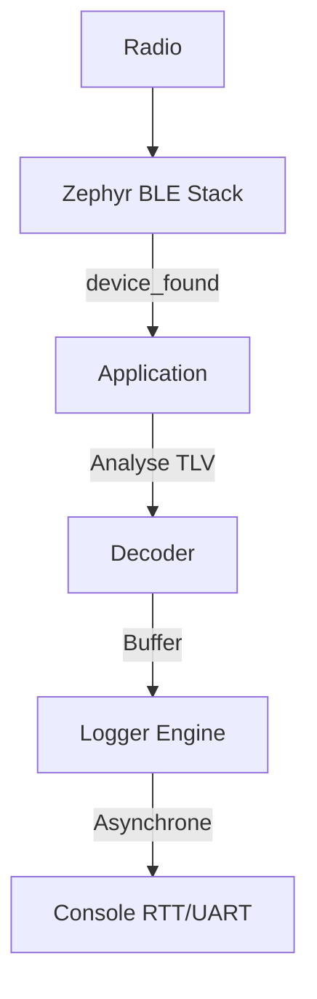

Modern wireless environments are crowded with Bluetooth Low Energy (BLE) signals from everything from smartwatches to asset trackers. Capturing this data efficiently requires a system that can keep up with high-frequency bursts without missing critical packets. This BLE Sniffer is a specialized utility built on the Zephyr RTOS, designed to provide a high-performance, passive monitoring solution for the latest generation of Nordic Semiconductor hardware.

### Efficiency through Architecture

At the heart of the sniffer is a zero-copy data pipeline. In embedded systems, copying data between memory buffers is a common source of latency and overhead. By architecting the system for zero-copy operations, the sniffer maximizes throughput and ensures that the processor can handle dense advertising environments with a minimal memory footprint.

The system decouples physical RF reception from the asynchronous processing and logging layers. This design is critical for preventing buffer overruns during packet bursts. When a device is found by the Zephyr BLE stack, the application passes the data to a decoder which then buffers it for the logger engine. By utilizing Zephyr’s deferred logging mode via UART or RTT, the sniffer eliminates timing jitter in the radio-critical sections of the code, allowing the logger to output data asynchronously when the CPU has idle cycles.

### Advanced Scanning and Parsing

To optimize packet catch rates, the sniffer employs dynamic dual-window intervals. By alternating scan windows, it can better capture packets from devices using varying advertising intervals, which is often a challenge for static sniffers. This passive approach ensures that the sniffer intercepts nearby packets without the overhead of active scanning or leaving a transmission footprint.

Beyond simple packet capture, the tool includes a sophisticated GAP payload parser. It extracts and decodes a wide variety of data types, including:
- Local Names and Flags
- TX Power levels
- 16-bit and 128-bit Service UUIDs
- Service Data and Manufacturer Data

### Integrated Hardware Lookups

One of the standout features of this sniffer is its built-in, zero-latency dictionary for hardware identification. Instead of requiring post-processing on a PC to identify the source of a packet, the sniffer performs lookups directly on the nRF54L15 hardware. This allows for real-time identification of common ecosystems such as Apple Find My, Google Fast Pair, and Samsung SmartThings, as well as various hardware manufacturers.

### System Design

The following diagram illustrates how data flows from the radio hardware through the Zephyr stack and into the final console output:

### Target Hardware

This implementation is specifically tailored for the Nordic nRF54L15-DK. As the nRF54 series represents the next step in ultra-low-power wireless SoC technology, this sniffer serves as both a practical tool and a reference for high-efficiency BLE development on the new platform. By leveraging the Zephyr RTOS, the project maintains a modular structure while tapping into the robust Bluetooth stack and logging infrastructure provided by the framework.
