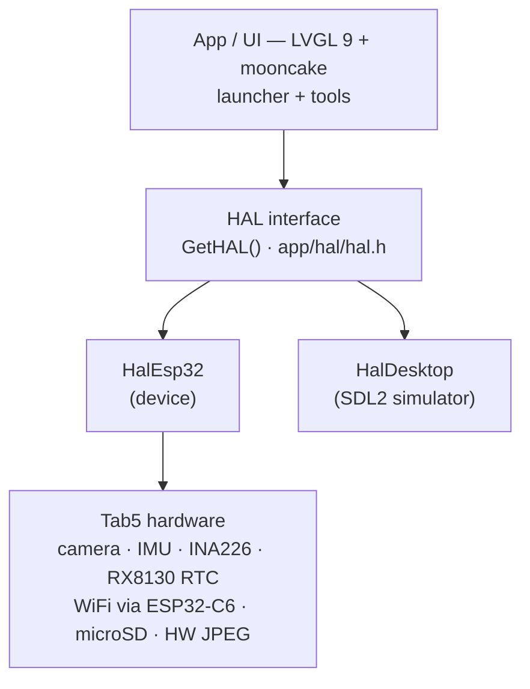

## A Versatile Launcher for the ESP32-P4

LOADOUT is a sophisticated firmware launcher and hardware utility suite specifically designed for the **M5Stack Tab5**, a powerful RISC-V device based on the ESP32-P4. While many embedded projects focus on a single application, LOADOUT transforms the Tab5 into a multi-purpose platform capable of managing multiple firmware images, performing secure over-the-air (OTA) updates, and providing deep access to the device's hardware peripherals through a refined graphical interface.

At its core, LOADOUT is a fork of the official M5Tab5-UserDemo, but it has been extensively rebuilt. It introduces a modular architecture centered around a launcher home screen, a high-performance widget-based UI using **LVGL 9**, and a robust Hardware Abstraction Layer (HAL) that enables both on-device execution and desktop simulation.

## Firmware Management and Safety

One of the standout features of LOADOUT is its approach to firmware management. The Tab5 is often used for experimentation, and LOADOUT makes this process safer through an A/B partition layout with built-in rollback capabilities. 

Users can simply drop `.bin` firmware files onto a microSD card, and LOADOUT will list and flash them to a free OTA slot. To prevent bricking, external firmwares are booted in a "pending-validation" state. If the new firmware fails to boot or does not explicitly mark itself as valid, the system automatically rolls back to LOADOUT on the next reset. This makes the Tab5 an ideal platform for developers who need to test multiple iterations of firmware without the constant fear of losing access to the device.

## The Hardware Toolbox

Beyond its role as a launcher, LOADOUT serves as a comprehensive hardware diagnostic suite. It exposes the Tab5’s rich set of peripherals through a series of on-device tools:

*   **Camera & Multimedia**: A live preview tool utilizes the SC2356 sensor via the `esp_video` pipeline. The system also includes a screen recorder that captures the framebuffer and encodes it using the ESP32-P4's hardware JPEG encoder.
*   **Sensors & Power**: Real-time visualization for the IMU (BMI270) and a power monitor that tracks bus voltage, current, and power via the INA226 sensor.
*   **Connectivity**: Integrated WiFi support (via the onboard ESP32-C6 co-processor) allows for an AI chatbot interface compatible with OpenAI/DeepSeek endpoints, and a web-based dashboard for remote device management.
*   **Diagnostics**: Includes an I2C scanner for internal and external buses, a UART monitor, and a GPIO testing utility.
*   **File Management**: A built-in file browser and text editor allow users to navigate the microSD card and modify configuration files directly on the device.

## Architecture and Desktop Simulation

LOADOUT is built on a HAL abstraction layer that separates the application logic from the underlying hardware. This design choice allows the same code to run on the physical ESP32-P4 hardware and a desktop simulator using **SDL2**. This significantly speeds up UI development and debugging, as developers can iterate on the interface and logic on a PC before flashing the device.

The UI framework utilizes `mooncake` and the `smooth_ui_toolkit`, providing animated C++ widget wrappers and modal windows that feel responsive on the Tab5's 1280x720 MIPI-DSI touch panel. The project also supports runtime color themes and a PIN lock screen for basic security.

## Getting Started

For most users, the easiest way to install LOADOUT is through the browser-based flasher, which requires no local toolchain installation. For developers, the project is built using **ESP-IDF v5.4.2**. 

Configuration is handled through a `loadout.conf` file on the microSD card, where users can set WiFi credentials, timezone settings, OTA URLs, and API keys for the AI chatbot. The repository is structured to separate the UI-agnostic application code from the platform-specific implementations, making it a clean reference for complex ESP32-P4 projects.
